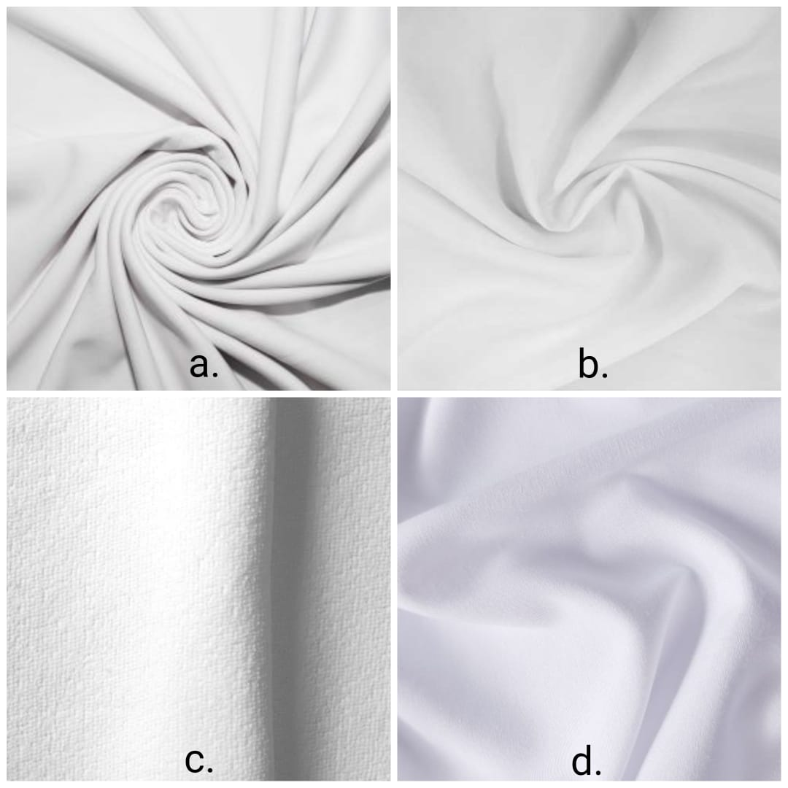
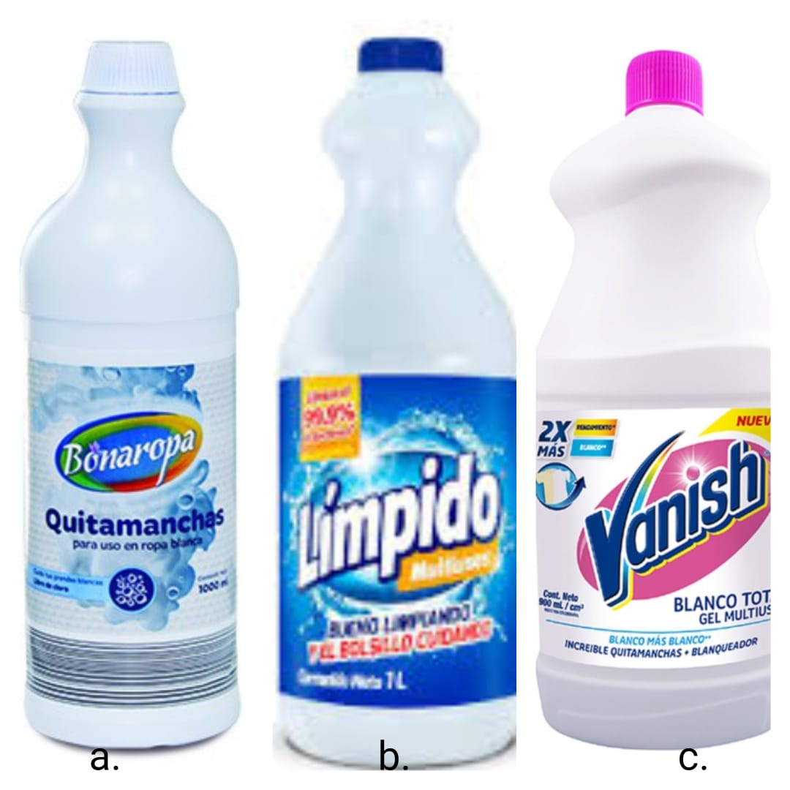

---
header-includes:
- \usepackage{longtable}
- \usepackage[utf8]{inputenc}
- \usepackage[spanish]{babel}\decimalpoint
- \setlength{\parindent}{1.25cm}
- \usepackage{amsmath}
output:
  pdf_document:
    number_sections: true
fontsize: 12pt
papersize: letter
geometry: margin = 1in
language: "es"
---

```{r setup, include=FALSE}
knitr::opts_chunk$set(echo = F, fig.align = 'center',  message = F, fig.pos = "H", fig.width=5, fig.height=4)
library(tidyverse)
library(knitr)
library(kableExtra)
library(readxl)
library(car)
```

\input{titlepage}
\thispagestyle{empty}
\tableofcontents
\listoffigures
\listoftables

\newpage

\pagestyle{myheadings}
\setcounter{page}{3}


\section{Introducción}

El detergente es una sustancia con capacidad peptizante física y química. Esto significa que cuando se diluye con líquido, atraerá y dispersará partículas de suciedad en ropa, platos u otros objetos. Todo esto en general sin causar desgaste ni corrosión, es decir, se utiliza para la limpieza porque tiene propiedades que permiten eliminar la suciedad sin afectar el material [1]. Por ello, podemos hablar de diferentes categorías de detergentes en función de su uso o en distintas presentaciones, como líquido, polvo o pastillas. También se dividen en agentes de limpieza orgánicos y agentes de limpieza químicos. Los limpiadores orgánicos se refieren a limpiadores que no contienen contaminantes y sustancias tóxicas para el medio ambiente y los seres humanos, mientras que los limpiadores químicos están hechos de sustancias sintéticas que han sido probadas en laboratorios y generalmente tienen un rendimiento superior a los limpiadores orgánicos. 

En este Diseño de Experimentos se intentará resolver un problema surgido de una situación cotidiana: ir de compras. Cuando compramos detergentes para ropa, nos damos cuenta del cambio en el precio de las diferentes marcas existentes en el mercado, pero ¿este aumento de precio está relacionado con una mayor eficiencia? El diseño presentado incluirá el uso de tres tipos de detergentes para la eliminación de nuestras manchas, presentados más adelante, con el objetivo de incluirlos en la comparativa de su efectividad. 

En base a los resultados que podemos obtener, se podrá concluir cómo pueden cambiar nuestros hábitos de consumo para mejorar la economía doméstica, en base a los productos que usamos a diario, como en el caso de los detergentes para ropa. Este informe presenta la realización del proyecto experimental, que consiste principalmente en mediciones de la eficacia de algunas marcas de detergentes líquidos en determinados tipos de tejidos. trata de determinar si el tipo de tela y la marca de detergente son factores importantes que afectan significativamente la variable respuesta (eficiencia de remoción de manchas). Lo que sigue es una descripción general del problema a tratar, así como una explicación de cómo se llevó a cabo el diseño experimental.

\section{Reconocimiento y planteamiento del problema}
\subsection{Planteamiento del problema}

Es bien sabido que en cada uno de los hogares se presenta el problema de la remoción de las manchas causadas por diferentes sustancias que caen sobre la ropa,  o en cualquier lugar del hogar;  esto se presenta en cualquier circunstancia de la vida cotidiana;  es por esto que los detergentes más comunes son los que se usan en los hogares,  ya sea para la limpieza de la zona de la cocina o para el lavado de la ropa.  Este trabajo se enfocará en los detergentes líquidos y su eficiencia a la hora de remover manchas en cuatro diferentes tipos de tela (_scuba_, microfibra, lino y poliéster).  Por lo tanto,  se desea conocer qué tipo de marca de detergente líquido resulta ser más eficiente al momento de eliminar un tipo de mancha en específico, sobre determinados tipos de tela. Entonces,  de ahí parte el interés en encontrar evidencia suficiente que permita recomendar alguna marca en específico, en su eficacia en la eliminación de manchas por sobre las demás que son puestas a prueba.


\subsection{Objetivo general}

Observar y determinar que tipo de detergente es el más efectivo para la remoción de un tipo de mancha en específico,  sobre determinados tipos de tela,  con el fin de encontrar diferencias significativas entre las marcas de detergentes y su eficiencia;  así mismo,  conocer como reaccionan las diferentes marcas de detergente frente a los tipos de tela. También,  reconocer si esta influye en la remoción de la mancha.  Además,  Observar si el detergente más económico es aquel que presenta la menor eficacia a la hora de eliminar manchas.

\section{Diseño expermiental}

Para determinar la eficiencia de los tres tipos de detergente: _Bonaropa_, _Límpido_ y _Vanish_, se seleccionó 4 tipos de tela: Poliester, Microfibra, Lino y _Scuba_, en donde se obtuvieron retazos para cada una de las telas, cada uno de igual medida, $20\times20~cm$.  A estos retazos de tela se les aplicó por igual 3 gotas de vino medidas con un gotero, y esta se dejó secar sobre cada retazo un aproximado de 5 minutos en cada uno.

\subsection{Descripción detallada del diseño experimental}

### Tipo de diseño experimental

A fin de estudiar el efecto de los tres tipos de detergentes sobre los cuatro distintos tipos de tela a la hora de mitigar la mancha causada por vino, se propone un diseño factorial de dos factores con efectos fijos cuyo modelo estadístico se presenta a continuación:

**Modelo estadístico:**

$$ Y_{ijk} = \mu + \tau_i + \beta_j + (\tau\beta)_{ij} + \varepsilon_{ijk}$$

* $\mu:$ Media global.
* $\tau_i:$ Efecto del i-esimo nivel del factor A (Tipos de tela), con $i=1,2,3,4$.
* $\beta_j:$ Efecto del j-esimo nivel del factor B (marcas de detergente liquido), con $j=1,2,3$.
* $(\tau\beta)_{ij}:$ Efecto de la interacción entre A y B, con $i=1,2,3,4$ y $j=1,2,3$.
* $\varepsilon_{ijk}:$ Término de error.

**Supuestos**

$$\varepsilon_{ijk} \sim NID(0, \sigma ^2)$$

**Restricción**

$$\sum \tau_i = \sum \beta_j = \sum_i (\tau\beta)_{ij} = \sum_j (\tau\beta)_{ij} = 0$$

\subsubsection{Definiciones del diseño experimental}
  
- __Unidad experimental:__ Cada uno de los retazos de tela.

- __Factores:__ Tipo de tela y las distintas marcas de detergente líquido.

- __Niveles del factor:__ Las combinaciones resultantes de combinar los niveles del factor __tela__: _Scuba_, Lino, Microfibra y Poliéster; y los niveles del factor __detergente__ desde el más económico, hasta el más costoso: _Bonaropa_, _Límpido_ y _Vanish_.

- **Variable respuesta:** Calificación promedio de la eficiencia de los detergentes obtenida gracias a las observaciones de los cuatro integrantes del equipo, siendo 5 la calificación más alta y 1 la más baja.


\subsubsection{Factores principales}

1. Tipo de tela

    - __Scuba:__ Grueso tejido de punto con trama en Licra e hilado de fibra torzal, con un gramaje de 275gsm. Scuba es una tela sólida realizada a través de la combinación de fibras de poliéster, entre las que se incluye el Policloropeno. Con una estructura con elasticidad en los 4 sentidos, especialmente en la trama. [2]
  
    - __Poliéster:__ El Poliéster es una fibra sintética que ofrece un abanico muy amplio de posibilidades: La intensidad del color de la estampación es mayor. Mayor resistencia a humedades, abrasiones y condiciones climáticas extremas. Fácil lavado. [3]

    - __Microfribra:__ La Microfibra es una fibra sintética y es altamente empleada en el mundo textil tanto para la elaboración de Toallas Deportivas y de Playa como material de limpieza. Se caracterizan por los hilos empleados en su fabricación, siendo cien veces más finos que el cabello humano. [4]
  
    - __Lino:__ La tela de lino es una fibra vegetal que se compone principalmente de celulosa. Procede del tallo de la planta de lino, cuya semilla, comestible, se llama linaza. [5]
    
{width=250 height=250}

  
2. Tipo de detergente, ordenados del más económico al más costoso, con la descripción que traen en sus etiquetas:

    - __Bonaropa:__ quitamanchas para ropa blanca. 1000 ml precio: $3.890 pesos.
    
    - __Límpido:__ ofrece un gran poder de desinfección necesario para la limpieza del hogar. Su alto nivel de concentración elimina hasta el 99,9% de gérmenes y bacterias. También es un excelente producto para remover las manchas difíciles. 1000 ml precio: $4.328 pesos.
    
    - __Vanish:__ es un quitamanchas sin cloro que elimina las manchas más dificiles de tus prendas a la vez que hace tus blancos más blancos. Ahora con su fórmula mejorada tambien elimina hasta el 99.9% de bacterias.. 1000 ml precio $10.278 pesos.
    
{width=250 height=250}

    
\subsubsection{Efectos fijos}

- A cada retazo de tela de 20x20 cm se les aplicó 3 gotas de vino (medidas mediante un gotero) y se dejó actuar 5 minutos en cada uno.

\subsection{Realización del diseño experimental}


\section{Resultados}

\subsection{Muestreo piloto}

```{r}
# Finamos semilla para generar la misma muestra para cada una
set.seed(1) 
# Microfibra
a <- sample(1:20,3)
# Escuba
b <- sample(1:20,3)
# Lino
c <- sample(1:20,3)
# Poliester
d <- sample(1:20,3)


```


- Resultados obtenidos:

\begin{table}[h!]
\center
\caption{Muestreo piloto}
\label{tab:my-table}
\begin{tabular}{|r|r|r|r|r|r|r|r|}
\hline
 & Tipo de tela & Tipo de detergente & Genaro & Martín & Valentina & Daniela & Promedio: $Y_i$ \\ \hline
1 & Escuba & Bonaropa & 4 & 4 & 4 & 4 & 4 \\ \hline
2 & Poliéster & Bonaropa & 4 & 5 & 4 & 4 & 4.25 \\ \hline
3 & Microfibra & Bonaropa & 5 & 5 & 4 & 5 & 4.75 \\ \hline
4 & Lino & Bonaropa & 5 & 4 & 5 & 4 & 4.5 \\ \hline
5 & Escuba & Límpido & 5 & 5 & 5 & 5 & 5 \\ \hline
6 & Poliéster & Límpido & 5 & 5 & 5 & 5 & 5 \\ \hline
7 & Microfibra & Límpido & 4 & 5 & 5 & 4 & 4.5 \\ \hline
8 & Lino & Límpido & 5 & 5 & 5 & 5 & 5 \\ \hline
9 & Escuba & Vanish & 3 & 2 & 4 & 3 & 3.25 \\ \hline
10 & Poliéster & Vanish & 3 & 1 & 2 & 2 & 2 \\ \hline
11 & Microfibra & Vanish & 5 & 3 & 4 & 4 & 4 \\ \hline
12 & Lino & Vanish & 4 & 5 & 5 & 4 & 4.5 \\ \hline
\end{tabular}
\end{table}


\subsection{Aplicación del diseño experimental}


Se realizaron 3 réplicas del diseño factorial para investigar el efecto de las telas y de los detergentes en la eficiencia al eliminar una mancha de vino. Los promedios obtenidos por cada detergente y tipo de tela en cada réplica aparece en la tabla siguiente:

\begin{table}[h!]
\center
\caption{Resultados aplicación del diseño}
\label{tab:my-table}
\begin{tabular}{c|ccc|}
\cline{2-4}
 & \multicolumn{3}{c|}{Detergente} \\ \cline{2-4} 
 & \multicolumn{1}{c|}{Más económico} & \multicolumn{1}{c|}{Medio} & Más costoso \\ \hline
\multicolumn{1}{|c|}{Tela} & \multicolumn{1}{c|}{Bonaropa} & \multicolumn{1}{c|}{Límpido} & Vanish \\ \hline
\multicolumn{1}{|c|}{Scuba} & \multicolumn{1}{c|}{\begin{tabular}[c]{@{}c@{}}3.25\\ 3.25\\ 3.75\end{tabular}} & \multicolumn{1}{c|}{\begin{tabular}[c]{@{}c@{}}4.5\\ 4.75\\ 5\end{tabular}} & \begin{tabular}[c]{@{}c@{}}2.5\\ 2.5\\ 1.5\end{tabular} \\ \hline
\multicolumn{1}{|c|}{Poliéster} & \multicolumn{1}{c|}{\begin{tabular}[c]{@{}c@{}}1.5\\ 1.25\\ 1.5\end{tabular}} & \multicolumn{1}{c|}{\begin{tabular}[c]{@{}c@{}}5\\ 4\\ 5\end{tabular}} & \begin{tabular}[c]{@{}c@{}}1.5\\ 1.25\\ 1.5\end{tabular} \\ \hline
\multicolumn{1}{|c|}{Microfibra} & \multicolumn{1}{c|}{\begin{tabular}[c]{@{}c@{}}3.25\\ 3.75\\ 4.25\end{tabular}} & \multicolumn{1}{c|}{\begin{tabular}[c]{@{}c@{}}5\\ 5\\ 4.5\end{tabular}} & \begin{tabular}[c]{@{}c@{}}3.5\\ 3.25\\ 4\end{tabular} \\ \hline
\multicolumn{1}{|c|}{Lino} & \multicolumn{1}{c|}{\begin{tabular}[c]{@{}c@{}}3.75\\ 4.5\\ 4.5\end{tabular}} & \multicolumn{1}{c|}{\begin{tabular}[c]{@{}c@{}}5\\ 5\\ 5\end{tabular}} & \begin{tabular}[c]{@{}c@{}}4.75\\ 4.5\\ 3.75\end{tabular} \\ \hline
\end{tabular}
\end{table}

```{r}
#Datos
Detergente <- as.factor(c(rep(c("Bonaropa","Límpido","Vanish"), 12)))
Tela <- as.factor(c(rep("Scuba", 9), rep("Poliéster", 9), rep("Microfibra", 9), rep("Lino", 9)))

Promedio <- c(3.25,4.5,2.5,3.25,4.75,2.5,3.75,5,1.5,
              1.5,5,1.5,1.25,4,1.25,1.5,5,1.5,
              3.25,5,3.5,3.75,5,3.25,4.25,4.5,4,
              3.75,5,4.75,4.5,5,4.5,4.5,5,3.75)
datos <- data.frame(Tela, Detergente, Promedio)

modPromedio <- aov(Promedio~Detergente*Tela)
resumen1 <-summary(modPromedio)


```

- Dado que los detergentes y los tipos de telas fueron seleccionados explicitamente por los integrnates del grupo, se considera un diseño de efectos fijos, por lo tanto, se Plantean, interpretan y realizan las pruebas de hipotesis que establecen la significancia de la interaccion y de los factores y se Analiza el posible encubrimiento de los factores.

\subsubsection{Estimación de los efectos de los niveles de los factores y de las interacciones(tratamientos)}


```{r}

mediaDeter <- tapply(Promedio,Detergente, mean)
desvD <- tapply(Promedio, Detergente, sd)

mediaTela <- tapply(Promedio, Tela, mean)
desvS <- tapply(Promedio, Tela, sd)

Interaccion <- tapply(Promedio, list(Detergente, Tela), mean)
InteraccionSd <- tapply(Promedio, list(Detergente, Tela), sd)
```

- En el siguiente gráfico se presentan las medias por cada nivel de los factores y de la interacción entre ellos:

\begin{table}[h]
\center
\caption{Medias de cada uno de los factores e interacción entre ellos}
\begin{tabular}{|c|cccc|c|}
\hline
{\color[HTML]{000000} Factor} & \multicolumn{4}{c|}{Factor Tela} & Media de niveles \\ \cline{2-5}
Detergente & Lino & Microfibra & Poliéster & Scuba & de factor Detergente \\ \hline
Bonaropa & 4.25 & 3.75 & 1.42 & 3.42 & 3.21 \\
Límpido & 5.00 & 4.83 & 4.67 & 4.75 & 4.81 \\
Vanish & 4.33 & 3.58 & 1.42 & 2.17 & 2.88 \\ \hline
Media por nivel & 4.53 & 4.06 & 2.50 & 3.44 & 3.63 = $\bar{\textbf{Y}}_{...}$ \\ \hline
\end{tabular}
\end{table}

1. Estimación de la media global $\mu$, siendo $N=n\times12=3\times12=36$:

$$\hat{\mu} = \bar{\textbf{Y}}... ~=  \frac{Y_{...}}{\textbf{N}}~=~3.63$$

2. Estimación del efecto ***Detergente*** $\tau_i, ~ i= 1:Bonaropa, ~ 2:Límpido, ~3: Vanish$

$$\hat{\tau}_i = \bar{\textbf{Y}}_{i..}-\bar{\textbf{Y}}_{...}, \ \ i=1,2,3$$

- $\hat{\tau_1} = \bar{\textbf{Y}}_{1..}-\bar{\textbf{Y}}_{...}\\$
  $\hat{\tau_1} = 3.21 - 3.63=-0.42$

- $\hat{\tau_2} = \bar{\textbf{Y}}_{2..}-\bar{\textbf{Y}}_{...}\\$ 
  $\hat{\tau_2}= 4.81 - 3.63 = 1.18$      

- $\hat{\tau_3} = \bar{\textbf{Y}}_{3..}-\bar{\textbf{Y}}_{...}\\$
  $\hat{\tau_3} = 2.88 - 3.63 = -0.75$


3. Estimación del efecto ***Tela*** $\beta_j$


$$\hat{\beta_j} = \bar{\textbf{Y}}_{.j.}-\bar{\textbf{Y}}_{...}, \ ~j~=~1:Lino,~2:Microfibra,~3:Poliéster,~4:Scuba$$


- $\hat{\beta_1} = \bar{\textbf{Y}}_{.1.}-\bar{\textbf{Y}}_{...}$
  $\hat{\beta_1} = 4.53-3.63=0.9$


- $\hat{\beta_2} = \bar{\textbf{Y}}_{.2.}-\bar{\textbf{Y}}_{...}$
  $\hat{\beta_2}= 4.06-3.63= 0.43$
  
- $\hat{\beta_3} = \bar{\textbf{Y}}_{.1.}-\bar{\textbf{Y}}_{...}$
  $\hat{\beta_3} = 2.50-3.63=-1.13$


- $\hat{\beta_4} = \bar{\textbf{Y}}_{.2.}-\bar{\textbf{Y}}_{...}$
  $\hat{\beta_4}= 3.44-3.63= -0.19$  
  

4. Estimación de las ***interacciones*** $\hat{(\tau \beta)}_{ij}$

$$\hat{(\tau \beta)}_{ij} ~=~ \bar{Y}_{ij.}-\bar{Y}_{i..}-\bar{Y}_{.j.}+\bar{Y}_{...}$$


- $\hat{(\tau \beta)}_{11} ~=~ \bar{Y}_{11.}-\bar{Y}_{1..}-\bar{Y}_{.1.}+\bar{Y}_{...} \\$
  $\hat{(\tau \beta)}_{11} ~=~ 601.6667-3.21-516.6667+3.63 = 90$


- $\hat{(\tau \beta)}_{12} ~=~ \bar{Y}_{12.}-\bar{Y}_{1..}-\bar{Y}_{.2.}+\bar{Y}_{...} \\$
  $\hat{(\tau \beta)}_{12} ~=~ 486.6667-3.21-581.6667+3.63=-90$


- $\hat{(\tau \beta)}_{21} ~=~ \bar{Y}_{21.}-\bar{Y}_{2..}-\bar{Y}_{.1.}+\bar{Y}_{...} \\$  
  $\hat{(\tau \beta)}_{21} ~=~ 498.3333-4.81-516.6667+ 3.63 = -19.1667$


- $\hat{(\tau \beta)}_{22} ~=~ \bar{Y}_{22.}-\bar{Y}_{2..}-\bar{Y}_{.2.}+\bar{Y}_{...} \\$ 
  $\hat{(\tau \beta)}_{22} ~=~ 601.6667-4.81-581.6667+ 3.63=19.1667$


- $\hat{(\tau \beta)}_{31} ~=~ \bar{Y}_{31.}-\bar{Y}_{3..}-\bar{Y}_{.1.}+\bar{Y}_{...} \\$
  $\hat{(\tau \beta)}_{31} ~=~ 450.0000-2.88-516.6667+ 3.63 = -70.8333$


- $\hat{(\tau \beta)}_{32} ~=~ \bar{Y}_{32.}-\bar{Y}_{3..}-\bar{Y}_{.2.}+\bar{Y}_{...} \\$
  $\hat{(\tau \beta)}_{32} ~=~ 656.6667-2.88-581.6667+ 3.63 = 70.8333$
  


\subsection{Modelo del diseño experimental}

$$ Y_{ijk} = \mu + \tau_i + \beta_j + (\tau\beta)_{ij} + \varepsilon_{ijk}$$

- insertar formula látex!!!

\subsection{Verificación de los supuestos}

\subsubsection{Normalidad}

```{r, fig.cap="Gráfico Qqplot"}
residuales <- residuals(modPromedio)
test <- shapiro.test(residuales)
qqnorm(residuales,main="Gráfico de normalidad de los residuos del modelo", cex.main = 1, cex = 1, pch = 20) 
qqline(residuales,col="#7d3434", lwd=2)
legend("topleft",title = "Test de Shapiro-Wilk",title.col="#7d3434",title.adj= 1, legend=rbind(c("Statistic W","p-value"), round(c(test$statistic,test$p.value),digits=6)), cex=.8)
```

- con una significancia del 5%, no se rechaza la hipotesis nula, es decir se cumple el supuesto de normalidad.


\subsubsection{Varianza}

```{r, fig.cap="Residuales vs. Valores ajustados"}
  res<-ggplot(modPromedio, aes(x=modPromedio$fitted.values, y=modPromedio$residuals))+
  geom_point()+
  geom_hline(yintercept=0,
           col="#7d3434", linetype="dashed")+
  theme(axis.title=element_text(size=10,face="bold"),
        axis.text=element_text(size=10, face="bold"))+
  xlab("Valores ajustados")+
           ylab("Residuales")+
  ggtitle("Residuales vs. Valores ajustados")
res
```


```{r}
b1 <- bartlett.test(residuales, Detergente)
b2 <- bartlett.test(residuales, Tela)
```

- A un nivel de significancia del 5% se cumple el supuesto de homogeneidad de varianza para el término de error del modelo.

\begin{table}[h]
\center
\caption{Resultados de R del test de Barlett para homogeneidad de varianza }
\label{tab:my-table}
\begin{tabular}{|c|}
\hline
{\color[HTML]{7D3434} \textbf{Bartlett test of homogeneity of variances}} \\ \hline
\textbf{Residuales y Detergente} \\ \hline
Bartlett's K-squared = 0.66288, df = 2, p-value = 0.7179 \\ \hline
\textbf{Residuales y Tela} \\ \hline
Bartlett's K-squared = 0.15063, df = 3, p-value = 0.9851 \\ \hline
\end{tabular}
\end{table}


\section{Conclusiones}


\newpage
\section{Referencias}

- [1]   https://definicion.de/detergente/

- [2]   https://www.contrado.es/impresion-en-tela-scuba

- [3]   https://waixo.com/blog/tela-de-poliester-que-es-para-que-utilizarla-ventajas-y-desventajas

- [4]   https://waixo.com/blog/que-es-la-tela-de-microfibra-todos-los-tipos-y-usos

- [5]  https://www.norvilsa.com/tela-de-lino


